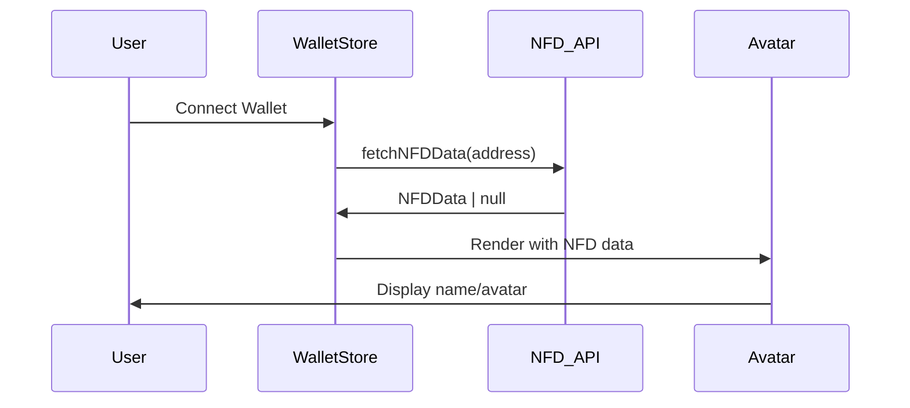

# NFD Integration Guide

The Finalyze dashboard integrates with the **NFD (Name Service for Algorand)** to resolve wallet addresses into human-readable `.algo` domain names, avatars, and social profile data. This enhances user experience by showing meaningful identity information instead of cryptographic addresses.

## 🎯 Purpose & Benefits

### Identity Resolution
- **Human-Readable Names**: Transform `ALGORAND123...XYZ` → `alice.algo`
- **Visual Identity**: Display custom avatars instead of generated initials
- **Social Profiles**: Access linked Twitter, Discord, Telegram, and website data
- **Verification Status**: Show verified domain status for trusted identities

### User Experience Improvements
- **Easier Recognition**: Users can identify accounts by memorable names
- **Professional Appearance**: Custom avatars provide personalized branding
- **Social Discovery**: Direct links to users' social media profiles
- **Trust Indicators**: Verification badges for authenticated domains

## 🏗️ Architecture Overview



## 📡 API Integration

### Core Implementation

**Location**: `src/lib/api/fetchNFD.ts`

```typescript
export async function fetchNFD(address: string): Promise<NFDResponse | null> {
  try {
    const response = await fetch(`https://api.nf.domains/nfd/lookup?address=${address}`);
    
    if (!response.ok) {
      return null;
    }

    const data = await response.json();
    
    if (!data || Object.keys(data).length === 0) {
      return null;
    }

    return data;
  } catch (error) {
    console.error('Error fetching NFD data:', error);
    return null;
  }
}
```

### Data Validation

The API uses robust error handling and caching:

```typescript
// Cache management
const nfdCache = new Map<string, { data: NFDResponse | null; timestamp: number }>();
const NFD_CACHE_DURATION = 10 * 60 * 1000; // 10 minutes

// Check cache first
const cacheKey = `nfd-${address}`;
const cached = nfdCache.get(cacheKey);

if (cached && Date.now() - cached.timestamp < NFD_CACHE_DURATION) {
  return cached.data;
}
```

## 🗂️ Type Definitions

**Location**: `src/types/nfd.ts`

```typescript
export interface NFDResponse {
  [key: string]: {
    name: string;
    avatar?: string;
    bio?: string;
    verified?: boolean;
    properties?: {
      userDefined?: {
        twitter?: string;
        discord?: string;
        telegram?: string;
        website?: string;
      };
    };
  };
}
```

## 🔄 Component Integration

### Address Resolution

**Location**: `src/lib/api/fetchNFD.ts`

```typescript
export async function resolveNFDName(nfdName: string): Promise<string | null> {
  try {
    // Clean the NFD name - ensure it ends with .algo
    const cleanName = nfdName.endsWith('.algo') ? nfdName : `${nfdName}.algo`;
    
    const response = await fetch(`https://api.nf.domains/nfd/${cleanName}`);
    
    if (!response.ok) {
      return null; // NFD not found
    }

    const data = await response.json();
    
    // Return the owner address if found
    return data && data.owner ? data.owner : null;
  } catch (error) {
    return null;
  }
}
```

## 🎨 Usage in Components

### NFDTag Component

**Location**: `src/components/NFDTag.tsx`

```typescript
export function NFDTag({ nfdData, className }: NFDTagProps) {
  if (!nfdData) return null;
  
  return (
    <div className={cn("flex items-center gap-2", className)}>
      <Badge variant="secondary" className="text-xs">
        {nfdData.name}
      </Badge>
      {nfdData.verified && (
        <CheckCircle className="h-3 w-3 text-green-500" />
      )}
    </div>
  );
}
```

## 🔧 Configuration

### Environment Variables

```bash
# Optional: NFD API configuration
VITE_NFD_API_URL=https://api.nf.domains  # Default value
```

## 📊 Performance Considerations

- **Caching**: NFD data is cached for 10 minutes to reduce API calls
- **Error Handling**: Graceful fallbacks when NFD data is unavailable
- **Rate Limiting**: Built-in retry logic with exponential backoff
- **Optional Integration**: NFD is non-critical, app works without it

## 🚀 Best Practices

1. **Always provide fallbacks**: Display address if NFD lookup fails
2. **Cache appropriately**: NFD data doesn't change frequently
3. **Handle errors gracefully**: Don't break the app if NFD is down
4. **Validate responses**: Check for empty or malformed data
5. **Use consistent naming**: Follow the established patterns in the codebase