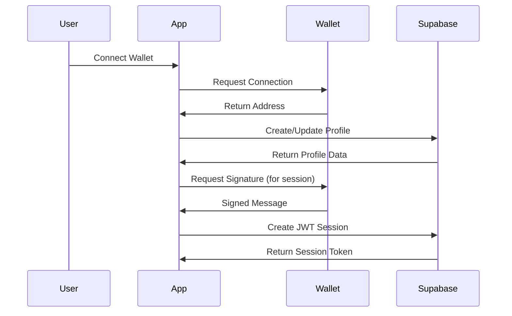

# Supabase Integration Guide

The Finalyze dashboard uses **Supabase** as its backend database and authentication system. This guide covers the wallet-based authentication flow, database schema, and integration patterns.

## 🔐 Wallet-Based Authentication Flow

Unlike traditional email/password auth, Finalyze uses **wallet signatures** for authentication:



## 🏗️ Database Schema

### Profiles Table

```sql
-- Located in Supabase Dashboard > Table Editor
CREATE TABLE profiles (
  id UUID DEFAULT gen_random_uuid() PRIMARY KEY,
  wallet_address TEXT NOT NULL UNIQUE,
  display_name TEXT,
  bio TEXT,
  avatar_url TEXT,
  twitter TEXT,
  discord TEXT,
  telegram TEXT,
  website TEXT,
  created_at TIMESTAMP WITH TIME ZONE DEFAULT NOW(),
  updated_at TIMESTAMP WITH TIME ZONE DEFAULT NOW()
);

-- RLS Policy: Users can only access their own profile
CREATE POLICY "Users can view own profile" ON profiles
  FOR SELECT USING (wallet_address = auth.jwt() ->> 'wallet_address');

CREATE POLICY "Users can update own profile" ON profiles
  FOR UPDATE USING (wallet_address = auth.jwt() ->> 'wallet_address');

CREATE POLICY "Users can insert own profile" ON profiles
  FOR INSERT WITH CHECK (wallet_address = auth.jwt() ->> 'wallet_address');
```

### Wallet Sessions Table

```sql
-- Session management for wallet-based auth
CREATE TABLE wallet_sessions (
  id UUID DEFAULT gen_random_uuid() PRIMARY KEY,
  wallet_address TEXT NOT NULL,
  session_token TEXT NOT NULL UNIQUE,
  expires_at TIMESTAMP WITH TIME ZONE NOT NULL,
  created_at TIMESTAMP WITH TIME ZONE DEFAULT NOW()
);

-- RLS Policy: Sessions are managed server-side only
CREATE POLICY "Service role only" ON wallet_sessions
  USING (auth.role() = 'service_role');
```

## 🔧 TypeScript Types

**Location**: `src/shared/types/supabase.ts`

```typescript
export interface Profile {
  id: string;
  wallet_address: string;
  display_name?: string;
  bio?: string;
  avatar_url?: string;
  twitter?: string;
  discord?: string;
  telegram?: string;
  website?: string;
  created_at: string;
  updated_at: string;
}

export interface WalletSession {
  id: string;
  wallet_address: string;
  session_token: string;
  expires_at: string;
  created_at: string;
}
```

## 🛠️ API Functions

**Location**: `src/shared/api/supabase.ts`

### Client Configuration

```typescript
import { createClient } from '@supabase/supabase-js';

const supabaseUrl = import.meta.env.VITE_SUPABASE_URL;
const supabaseAnonKey = import.meta.env.VITE_SUPABASE_ANON_KEY;

if (!supabaseUrl || !supabaseAnonKey) {
  throw new Error('Missing Supabase environment variables');
}

export const supabase = createClient(supabaseUrl, supabaseAnonKey);
```

### Profile Operations

#### Get Profile

```typescript
export async function getProfile(walletAddress: string): Promise<Profile | null> {
  const { data, error } = await supabase
    .from('profiles')
    .select('*')
    .eq('wallet_address', walletAddress)
    .single();

  if (error) {
    console.error('Error fetching profile:', error);
    return null;
  }

  return data;
}
```

#### Upsert Profile

```typescript
export async function upsertProfile(profile: Partial<Profile>): Promise<Profile | null> {
  const { data, error } = await supabase
    .from('profiles')
    .upsert(profile)
    .select()
    .single();

  if (error) {
    console.error('Error upserting profile:', error);
    return null;
  }

  return data;
}
```

### Session Management

```typescript
export async function createWalletSession(walletAddress: string): Promise<WalletSession | null> {
  const sessionToken = crypto.randomUUID();
  const expiresAt = new Date();
  expiresAt.setHours(expiresAt.getHours() + 24); // 24 hour expiry

  const { data, error } = await supabase
    .from('wallet_sessions')
    .insert({
      wallet_address: walletAddress,
      session_token: sessionToken,
      expires_at: expiresAt.toISOString(),
    })
    .select()
    .single();

  if (error) {
    console.error('Error creating wallet session:', error);
    return null;
  }

  return data;
}
```

## 🚀 Supabase Edge Functions

For server-side operations that require authentication or complex business logic, use Edge Functions:

### Function Structure

```typescript
// supabase/functions/wallet-auth/index.ts
import { serve } from 'https://deno.land/std@0.168.0/http/server.ts';
import { createClient } from 'https://esm.sh/@supabase/supabase-js@2';

const corsHeaders = {
  'Access-Control-Allow-Origin': '*',
  'Access-Control-Allow-Headers': 'authorization, x-client-info, apikey, content-type',
};

serve(async (req) => {
  if (req.method === 'OPTIONS') {
    return new Response('ok', { headers: corsHeaders });
  }

  try {
    const { walletAddress, signature } = await req.json();
    
    // Verify wallet signature
    const isValid = await verifyWalletSignature(walletAddress, signature);
    
    if (!isValid) {
      return new Response(
        JSON.stringify({ error: 'Invalid signature' }),
        { status: 401, headers: { ...corsHeaders, 'Content-Type': 'application/json' } }
      );
    }

    // Create authenticated session
    const supabase = createClient(
      Deno.env.get('SUPABASE_URL') ?? '',
      Deno.env.get('SUPABASE_SERVICE_ROLE_KEY') ?? ''
    );

    // Your authentication logic here...
    
  } catch (error) {
    return new Response(
      JSON.stringify({ error: error.message }),
      { status: 400, headers: { ...corsHeaders, 'Content-Type': 'application/json' } }
    );
  }
});
```

### Deploy Edge Function

```bash
# Install Supabase CLI
npm install -g supabase

# Deploy function
supabase functions deploy wallet-auth --project-ref YOUR_PROJECT_REF
```

## 🔒 Row Level Security (RLS)

### Enable RLS on Tables

```sql
-- Enable RLS on profiles table
ALTER TABLE profiles ENABLE ROW LEVEL SECURITY;

-- Enable RLS on wallet_sessions table  
ALTER TABLE wallet_sessions ENABLE ROW LEVEL SECURITY;
```

### Custom JWT Claims

For wallet-based auth, inject wallet address into JWT:

```sql
-- Function to set JWT claims
CREATE OR REPLACE FUNCTION set_wallet_claims(wallet_addr TEXT)
RETURNS VOID AS $$
BEGIN
  UPDATE auth.users 
  SET raw_user_meta_data = 
    COALESCE(raw_user_meta_data, '{}'::jsonb) || 
    jsonb_build_object('wallet_address', wallet_addr)
  WHERE id = auth.uid();
END;
$$ LANGUAGE plpgsql SECURITY DEFINER;
```

### RLS Policy Examples

```sql
-- Profile access policy
CREATE POLICY "Wallet owners can access own profile" ON profiles
  FOR ALL USING (
    wallet_address = COALESCE(
      auth.jwt() ->> 'wallet_address',
      current_setting('request.jwt.claims', true)::json ->> 'wallet_address'
    )
  );

-- Read-only public profiles
CREATE POLICY "Public profiles are viewable" ON profiles
  FOR SELECT USING (
    display_name IS NOT NULL -- Only show completed profiles
  );
```

## 🌍 Environment Configuration

### Required Environment Variables

```bash
# Located in: .env.local (development) or deployment config
VITE_SUPABASE_URL=https://your-project.supabase.co
VITE_SUPABASE_ANON_KEY=your-anon-key-here
```

### Supabase Project Settings

1. **Database**: PostgreSQL with RLS enabled
2. **Auth**: Disable email auth, custom JWT handling
3. **API**: Auto-generated REST API with TypeScript types
4. **Edge Functions**: For wallet signature verification
5. **Storage**: Optional for avatar uploads

## 🧪 Testing with Supabase

### Local Development

```bash
# Start local Supabase (optional)
supabase start

# Generate TypeScript types
supabase gen types typescript --local > src/shared/types/database.ts
```

### Mock Data for Testing

```typescript
// Test utilities
export const mockProfile: Profile = {
  id: 'test-uuid',
  wallet_address: 'ALGORAND_ADDRESS_123...',
  display_name: 'Test User',
  bio: 'Test bio',
  avatar_url: null,
  twitter: 'testuser',
  discord: null,
  telegram: null,
  website: 'https://test.com',
  created_at: new Date().toISOString(),
  updated_at: new Date().toISOString(),
};
```

## 🔮 Advanced Features

### Real-time Subscriptions

```typescript
// Subscribe to profile changes
useEffect(() => {
  const subscription = supabase
    .channel('profile-changes')
    .on('postgres_changes', 
      { 
        event: 'UPDATE', 
        schema: 'public', 
        table: 'profiles',
        filter: `wallet_address=eq.${walletAddress}`
      }, 
      (payload) => {
        console.log('Profile updated:', payload.new);
      }
    )
    .subscribe();

  return () => subscription.unsubscribe();
}, [walletAddress]);
```

### File Storage Integration

```typescript
// Upload avatar to Supabase Storage
export async function uploadAvatar(file: File, walletAddress: string) {
  const fileExt = file.name.split('.').pop();
  const fileName = `${walletAddress}.${fileExt}`;
  
  const { data, error } = await supabase.storage
    .from('avatars')
    .upload(fileName, file, { upsert: true });

  if (error) throw error;
  
  return data.path;
}
```

This integration provides a robust, scalable backend that seamlessly handles wallet-based authentication while maintaining excellent security through RLS policies.